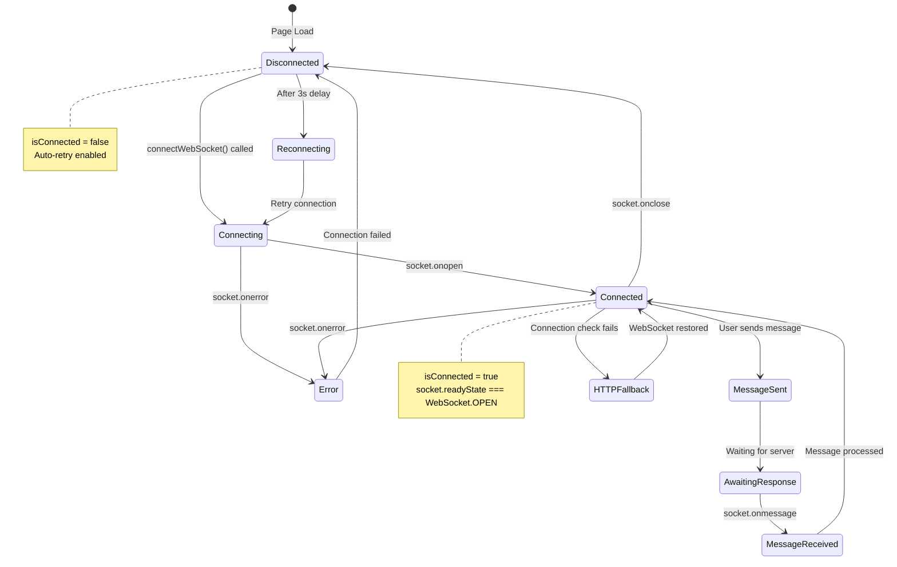
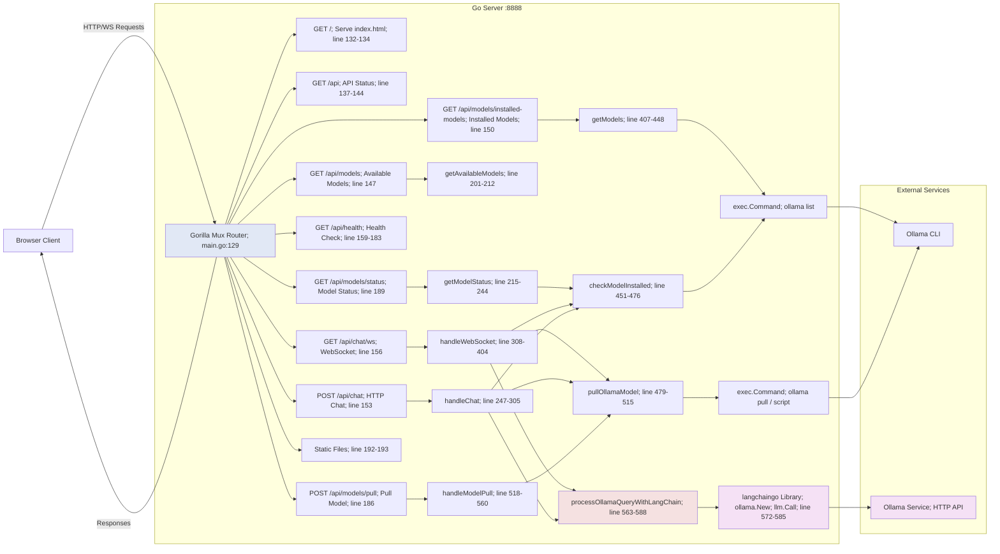
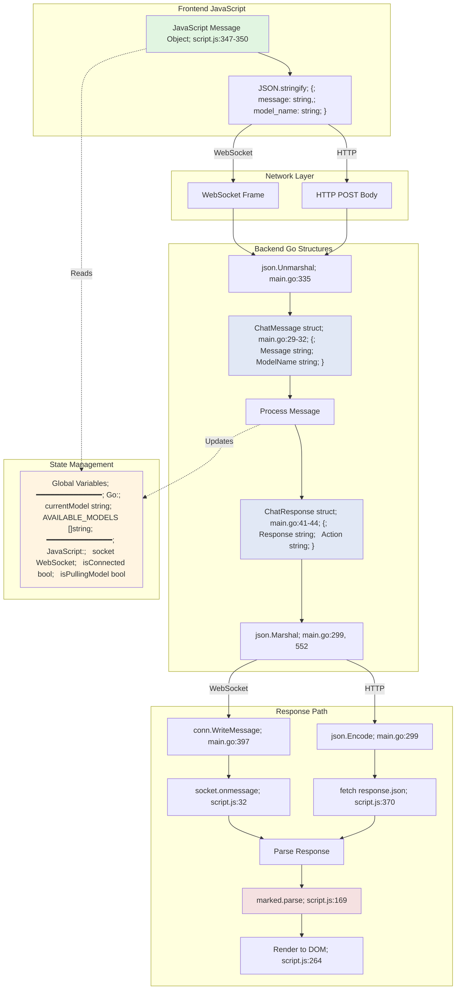
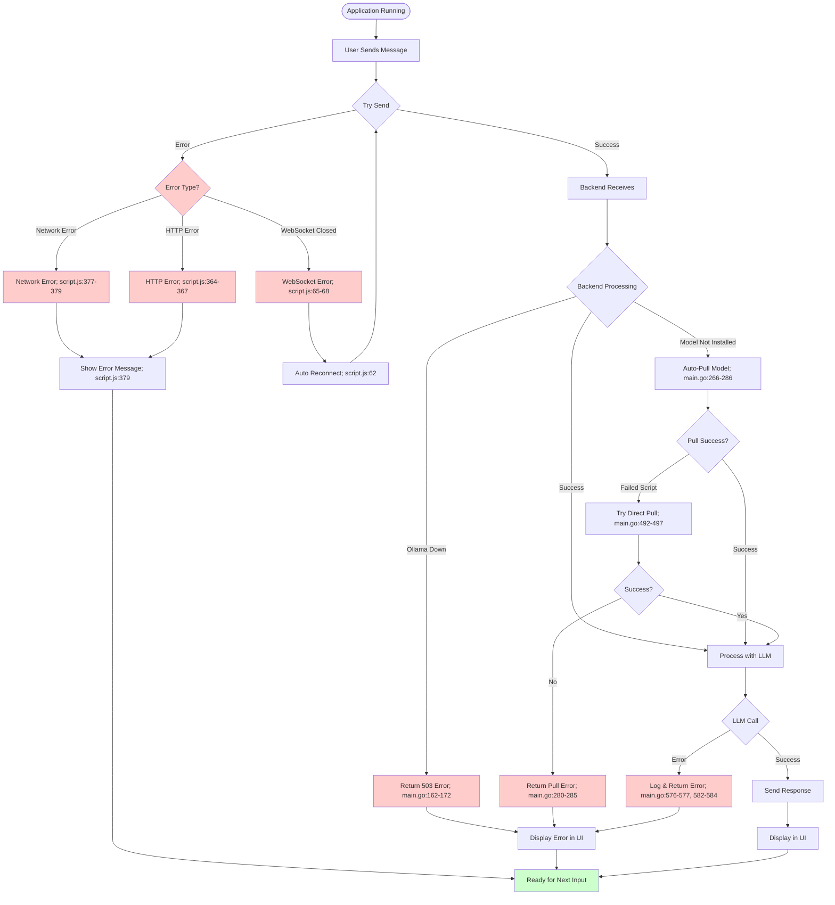

# OllamaMax - Mermaid Flow Diagrams

## 1. Complete User Interaction Flow

```mermaid
graph TB
    Start([User Opens Browser]) --> LoadPage[Load index.html]
    LoadPage --> LoadAssets[Load CSS, JS, Libraries]
    LoadAssets --> DOMReady[DOMContentLoaded Event]
    
    DOMReady --> InitVars[Initialize Variables]
    InitVars --> ConnectWS[Connect WebSocket]
    InitVars --> CheckStatus[Check Model Status]
    
    ConnectWS --> WSOpen{WebSocket Connected?}
    WSOpen -->|Yes| SetConnected[isConnected = true]
    WSOpen -->|No| Retry[Retry after 3s]
    Retry --> ConnectWS
    
    CheckStatus --> UpdateUI[Update Model Dropdown]
    
    SetConnected --> AttachEvents[Attach Event Listeners]
    UpdateUI --> AttachEvents
    
    AttachEvents --> Ready[Display Center UI]
    
    Ready --> UserAction{User Action}
    
    UserAction -->|Select Model| ModelChange[Model Change Event]
    UserAction -->|Type Message| TypeMsg[User Types in Input]
    UserAction -->|Click Send| SendClick[Send Button Click]
    UserAction -->|Press Enter| EnterKey[Enter Key Press]
    
    ModelChange --> CheckInstalled{Model Installed?}
    CheckInstalled -->|Yes| NotifyReady[Show Switched to Model]
    CheckInstalled -->|No| NotifyPull[Show Will download]
    
    TypeMsg --> UserAction
    NotifyReady --> Ready
    NotifyPull --> Ready
    
    SendClick --> ValidateInput{Input Not Empty?}
    EnterKey --> ValidateInput
    
    ValidateInput -->|No| Ready
    ValidateInput -->|Yes| AddUserMsg[Add Message to UI]
    
    AddUserMsg --> HideCenter[Hide Center Content]
    HideCenter --> SendToBackend[sendMessage Function]
    
    SendToBackend --> ShowTyping[Show Typing Indicator]
    ShowTyping --> SelectModel[Get Selected Model]
    
    SelectModel --> CheckConnection{WebSocket Connected?}
    
    CheckConnection -->|Yes| SendWS[Send via WebSocket]
    CheckConnection -->|No| SendHTTP[Send via HTTP POST]
    
    SendWS --> BackendWS[Go WebSocket Handler]
    SendHTTP --> BackendHTTP[Go HTTP Handler]
    
    BackendWS --> ParseJSON[Unmarshal JSON]
    BackendHTTP --> ParseJSON
    
    ParseJSON --> CheckModel{Model Name; Provided?}
    
    CheckModel -->|Yes| CheckInstall[checkModelInstalled; main.go:451-476; Run: ollama list]
    CheckModel -->|No| UseCurrentModel[Use currentModel; main.go:73]
    
    CheckInstall --> IsInstalled{Model; Installed?}
    
    IsInstalled -->|Yes| UpdateCurrent[Update currentModel; main.go:385-386]
    IsInstalled -->|No| NotifyPulling[Send 'Pulling model'; main.go:359-363]
    
    NotifyPulling --> ShowPullUI[Show Model Pulling Indicator; script.js:294-319]
    ShowPullUI --> PullModel[pullOllamaModel; main.go:479-515]
    
    PullModel --> RunScript[Run Shell Script; ./ollama_pull_and_run.sh; main.go:484]
    RunScript --> ScriptFail{Success?}
    
    ScriptFail -->|No| Fallback[Fallback: ollama pull; main.go:492-497]
    ScriptFail -->|Yes| AddToList[Add to AVAILABLE_MODELS; main.go:503-512]
    Fallback --> AddToList
    
    AddToList --> SendSuccess[Send 'Successfully pulled'; main.go:377-381]
    SendSuccess --> HidePullUI[Hide Pulling Indicator; script.js:322-333]
    HidePullUI --> UpdateCurrent
    
    UseCurrentModel --> ProcessQuery[processOllamaQueryWithLangChain; main.go:392, 563-588]
    UpdateCurrent --> ProcessQuery
    
    ProcessQuery --> FormatPrompt[Format Prompt with Template; main.go:569]
    FormatPrompt --> InitOllama[Initialize Ollama Client; langchaingo; main.go:572-578]
    
    InitOllama --> CallLLM[Call LLM; llm.Call with model & prompt; main.go:581-585]
    
    CallLLM --> OllamaService[Ollama Service; Model Inference]
    OllamaService --> GetResponse[Get Response String; main.go:587]
    
    GetResponse --> SendResponse{Which; Protocol?}
    
    SendResponse -->|WebSocket| SendWSResp[Send via WebSocket; main.go:397-400]
    SendResponse -->|HTTP| SendHTTPResp[Send JSON Response; main.go:299-304]
    
    SendWSResp --> ReceiveJS[Receive in JavaScript; socket.onmessage; script.js:32-56]
    SendHTTPResp --> ReceiveJS
    
    ReceiveJS --> RemoveTyping[Remove Typing Indicator; script.js:54, 286-291]
    RemoveTyping --> ParseMarkdown[Parse Markdown; marked.parse; script.js:169]
    
    ParseMarkdown --> Highlight[Apply Syntax Highlighting; hljs.highlightElement; script.js:172-224]
    
    Highlight --> DisplayMsg[Display Message in UI; script.js:264-267]
    DisplayMsg --> ScrollChat[Scroll to Bottom; script.js:267]
    
    ScrollChat --> Ready
    
    style Start fill:#e1f5e1
    style Ready fill:#fff4e1
    style BackendWS fill:#e1e8f5
    style BackendHTTP fill:#e1e8f5
    style OllamaService fill:#f5e1f5
    style DisplayMsg fill:#e1f5e1
```



## 2. Model Selection & Auto-Pull Flow


## 3. WebSocket Lifecycle & Reconnection



## 4. Backend API Architecture



## 5. Data Structures & Message Flow



## 6. Error Handling Flowchart



## 7. Component Interaction Timeline

```mermaid
gantt
    title OllamaMax - Complete Request Timeline
    dateFormat X
    axisFormat %L ms
    
    section Browser
    Page Load                      :0, 100
    Initialize JS                  :100, 50
    Connect WebSocket             :150, 100
    User Types Message            :250, 500
    Click Send                    :750, 10
    Package & Send                :760, 40
    Show Typing Indicator         :800, 1500
    Receive Response              :2300, 50
    Parse Markdown                :2350, 100
    Apply Highlighting            :2450, 150
    Display Message               :2600, 50
    
    section Go Server
    Receive Request               :800, 50
    Unmarshal JSON                :850, 20
    Check Model Status            :870, 100
    Process Query                 :970, 1200
    Format Response               :2170, 30
    Send Response                 :2200, 100
    
    section Ollama
    Receive LLM Call              :970, 50
    Load Model                    :1020, 150
    Run Inference                 :1170, 1000
    Return Result                 :2170, 50
    
    section Shell
    Execute ollama list           :870, 100
```

## Key File & Line References

### JavaScript (script.js)
- **Lines 1-23**: Variable declarations and setup
- **Lines 24-72**: WebSocket connection management  
- **Lines 75-105**: Model status checking
- **Lines 147-268**: Message display and UI rendering
- **Lines 271-333**: Loading indicators (typing, pulling)
- **Lines 336-381**: Message sending logic
- **Lines 384-446**: Event listeners (send, enter, model change)
- **Lines 454-484**: Model selection handler

### Go (main.go)
- **Lines 47-73**: Global variables (models, state)
- **Lines 127-198**: Router setup and endpoints
- **Lines 201-244**: Model info endpoints
- **Lines 247-305**: HTTP chat handler
- **Lines 308-404**: WebSocket chat handler
- **Lines 407-448**: Get installed models
- **Lines 451-476**: Check model installed
- **Lines 479-515**: Pull/download model
- **Lines 518-560**: Model pull endpoint
- **Lines 563-588**: LLM query processing

### HTML (index.html)
- **Lines 96-113**: Model selector dropdown
- **Lines 118-120**: Chat messages container
- **Lines 123-132**: Bottom input area (post-message)
- **Lines 135-194**: Center content area (initial)
